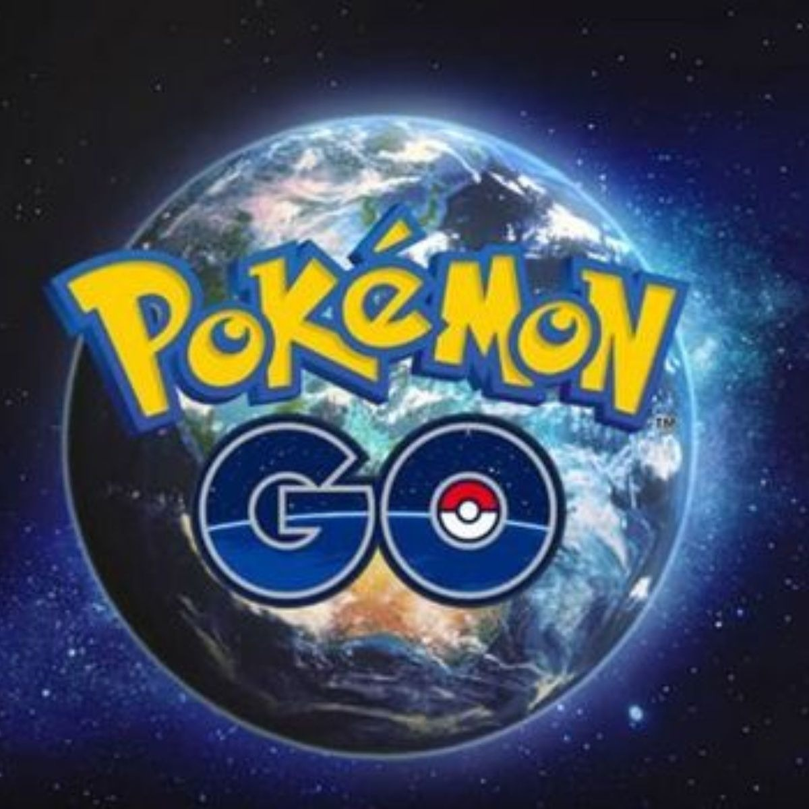
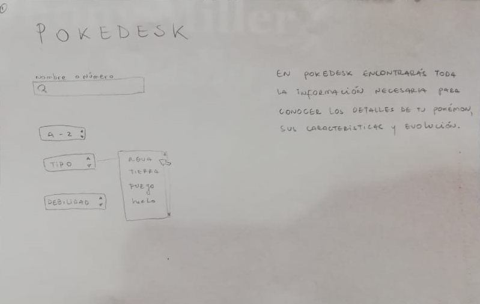
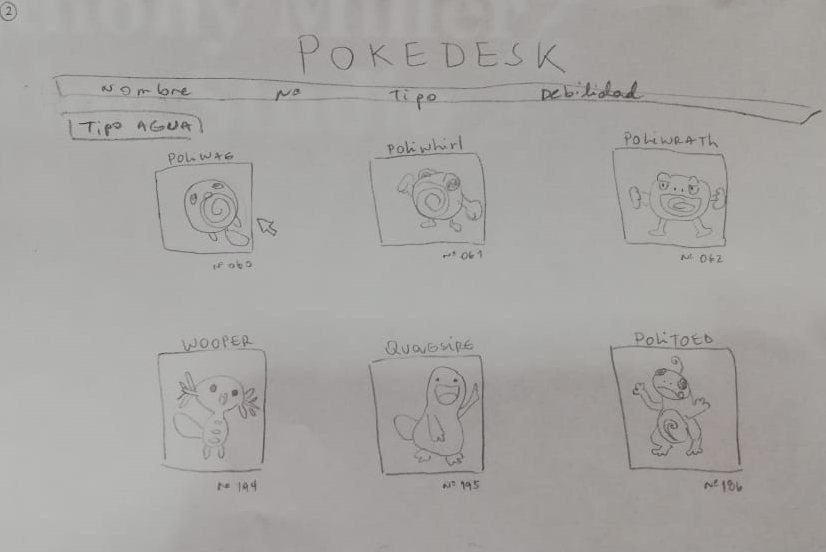
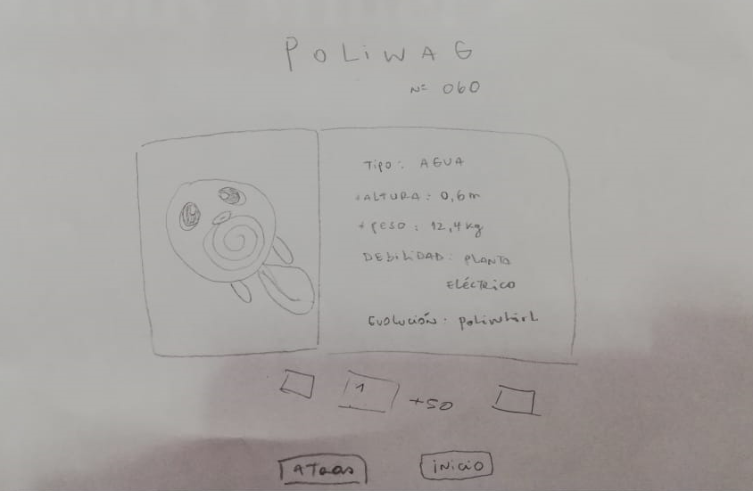
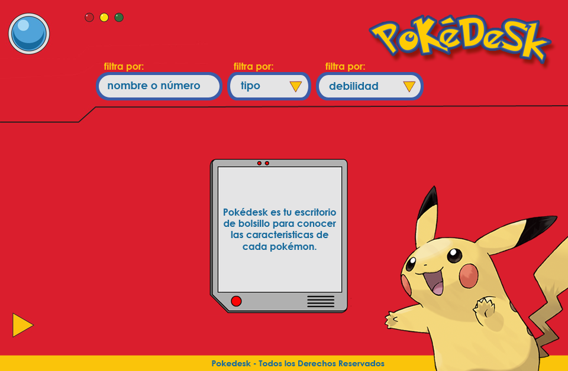
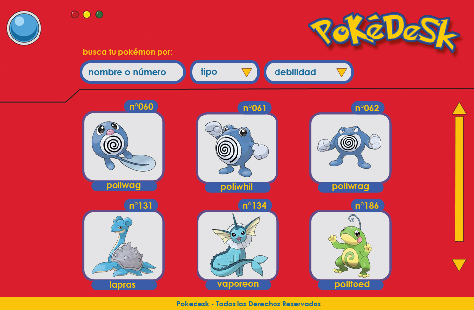
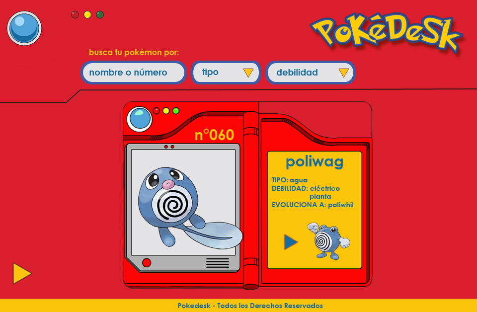

# Pokédesk 

## Índice

* [1. Preámbulo](#1-preámbulo)
* [2. Definición del Producto](#2-definiresumen-del-proyecto)
* [3. Diseño de Interfaz de Usuario](#3diseño-de-Interfazdeusuario)
* [4. Prototipo de Baja Fidelidad](#4-Prototipo-de-baja-Fidelidad)
* [5. Prototipo de Alta Fidelidad](#5-prototipo-de-alta-fidelidad)
* [6. Testeos de Usabilidad](#6-testeos-de-usabilidad)
* [7. Herramientas Utilizadas](#7-Herramientas-utilizadas)
* [8. Planificación del Proyecto](#8-Planificación-del-proyecto)

***

## 1. Preámbulo

Según [Forbes](https://www.forbes.com/sites/bernardmarr/2018/05/21/how-much-data-do-we-create-every-day-the-mind-blowing-stats-everyone-should-read),
el 90% de la data que existe hoy ha sido creada durante los últimos dos años.
Cada día generamos 2.5 millones de terabytes de datos, una cifra sin precedentes.

No obstante, los datos por sí mismos son de poca utilidad. Para que esas
grandes cantidades de datos se conviertan en **información** fácil de leer para
los usuarios, necesitamos entender, procesar y mostrar estos datos. Una manera
simple de hacerlo es creando _interfaces_ y _visualizaciones_.

Por lo cual este Readme, viene a explicar el proceso de desarrollo de Pokédesk, su proceso de creación y manejo de Data.  

## 2.  Definición del producto 📝

## ¿Quiénes son los(as) principales usuarios(as) de Pokédesk? 🙋‍♂🙋‍♀

Se trata de una aplicación que se encuentra creada para todos los **jugadores de Pokémon Go**, principalmente enfocada en quienes se encuentran iniciando su camino cómo maestro pokémon. 

Por ello, el objetivo es que **el(la) nuevo(a) jugador(a) pueda visualizar, ordenar y filtrar la información** que le permita adquirir los  conocimientos necesarios respondiendo a sus necesidades, en el camino a **convertirse en un maestro Pokémon.**  

Para ello, como equipo creamos:

## ¿Cuáles son los objetivos de estos usuarios(as) en relación con el producto? 🎯

Los objetivos de los(as) usarios(as) en relación a Pokédesk, es principalmente **adquirir informacón relevante que le permita conocer en primera instancia cada uno de los Pokémon**, visualizando la información relevante y esencial que favorezca su inmersión de manera **fácil y amigable**.

Dentro de la información considerada relevante, cabe dar cuenta aspectos cómo el nombre, número y una foto que lo(a) caracterice, que le permita reconocer cada uno de ellos, por el otro lado de la tarjeta la información proporcionada será más en detalle logrando que  conozca por ejemplo, acerca del tipo de Pokémon, su debilidad así como su altura y peso. 

## ¿Cuáles son los datos más relevantes que quieren ver en la interfaz y por qué?

Los datos más relevantes que nos arrojó la entrevista manual a los usarios, estima que esta muestre de manera fácil, información acerca de cada uno de los Pokémon, para despues poder acceder a funcionalidades más avanzadas como entrenador(a), como enfrentarlo(s) yendo más allá de sólo coleccionarlos. 

>Me gustaría que la app **mostrará la información de cada Pokémon**, el tipo, ataques y debilidades, por ejemplo con qué tipo de pokemon puedo enfrentarlo.

## ¿Cuándo utilizan o utilizarían el producto?

Pokédesk está pensado para que sea utilizado por el usuario(a) cuando necesite **encontrar informacion rapida sobre pokemones, su tipo, consiguiendo así usar la informacion de manera inmediata**, es por ello que la web ofrece una interfaz simple , ya que la  informació se necesita al instante. 

## 3. Diseño de la Interfaz de Usuario 🎨

### -  Historias de usuario 🙎‍
HU 1
Como: Jugador de Pokemon.

Quiero : Ver los distintos tipos de Pokémon que existen.

Para: Conocer cuales son. 

HU 2 Como: Jugador(a) de Pokemon.

Quiero : Ordenar los Pokémon de acuerdo a los diversos tipos que existen.

Para: Coleccionar mejores pokemones.

HU 3

Como: Jugador de pokemon.

Quiero : Ver información de las debilidades que tiene cada pokemon.

Para: Poder capturar al  mejor pokemon. 

### -  Encuesta 📋

Como equipo dimos cuenta de la necesidad de conocer a los jugadores de Pokémon, por lo cual realizamos una encuesta con el Formulario de Google Forms, obteniendo de este modo mayor información acerca de  jugadores de Pokémon Go, recibiendo un total de 7 respuestas, sin embargo, esta información nos permitió definir hacia quienes sería enfocada nuestra app. 

- La encuesta puedes visualizarla en el presente [link](
https://docs.google.com/forms/d/1sHfFOX7TG0YXhbRd0OGOJTeIZ_eLUxvh_fMWAxE-4E4/edit?fbclid=IwAR17mLKkuWZyLtvFf_DHh8J2-3Xb1s739ySO0hETqFavXh4CzIpU1ZHc-90#responses)

## 4.  Prototipo de baja fidelidad

Nuestra idea inicial acerca de Pokédesk, fue hacer varias pantallas una de inicio cómo muestra el prototipo a continuación, la cual entregaría la información general de la página,  así como las opciones de filtrado de entrega de la información 

la cual le permita al(la) entrenador(a)  contar con una panorámica general de cuales los Pokémon. 

y  si escogiese uno para conocer más detalles, la información se despliegue como a continuación. 

## 5. Prototipo de alta fidelidad

Iniciamos entonces la producción de nuestros prototipos de alta Fidelidad en Photoshop, herramienta escogida para nuestro diseño visual. 
La siguiente era nuestra idea inicial, de pantalla de inicio. 

la siguiente pantalla es la pensada previamente en el prototipado inicial.

  

Mientras que la tercera pensamos que se vería más menos así...

 

## 6. Testeos de usabilidad

Durante el reto deberás hacer _tests_ de usabilidad con distintos usuarios, y
en base a los resultados, deberás iterar tus diseños. Cuéntanos
qué problemas de usabilidad detectaste a través de los _tests_ y cómo los
mejoraste en tu propuesta final.

## 7. Herramientas Utilizadas  🛠

- JavaScript(ES6)
- HTML5
- CSS3. 

## 8. Planificación del proyecto 📑

La planificación fué realizada con Trello la puedes encontrar 
[aquí](https://trello.com/b/C2b0pm4S/pokemongo)